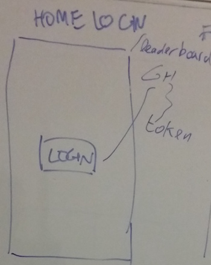
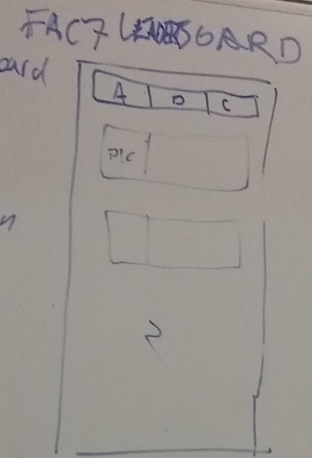
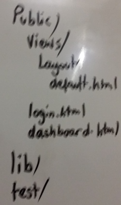

# FAILURES & CHAMPS!
Check it out on [heroku](https://failuresandchamps.herokuapp.com/). You will need to login with your github account.
## WHAT
Who is the most active Github contributor of the week? Failures N Champs displays the leaderboard for members of the [FAC7 organization](https://github.com/FAC7/). The members are ranked in terms of commits on the master branch of any repository over the last calendar week.
## WHY
To learn and practice the technologies in the "HOW" section.

## HOW
The app makes use of the following technologies:
* [HapiJS](https://hapijs.com) to make GET and POST requests with a chosen API(s)
* **OAuth** with **Gituhb API** (preferred over Facebook, as it is more *"open"* for developers)
* **JWT** to store access token
* **POST** requests on this [**Twitter** account](https://twitter.com/FailuresNChamps)
* *Redis* database to store JWT
* *Heroku* to deploy the app
* *Handlebars* for html template rendering
* *SASS* for css

After successfully logging on Github, the app
* retrieves the list of members from FAC7
* gets all the events per member
* gets comprehensive list of all repos of all members
* checks for "total" contributions to the members (starting from last Sunday at 00:00:00).

## WIREFRAMES
### Login page

### Leaderboard

### Folder Structure

